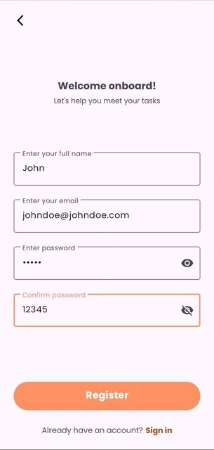
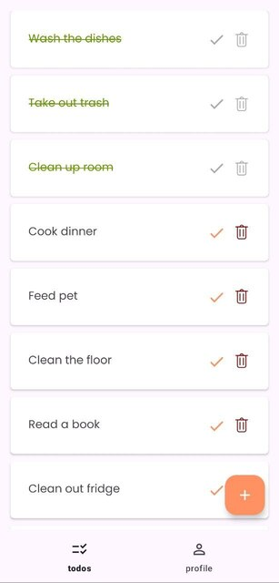

# FireBase Todo

Android-приложение для управления вашими задачами.
---

## Возможности

+ Регистрация
+ Создание и редактирование возникшей задачи
+ Отслеживание общего количества поставленных и выполненных задач
+ Редактирование и удаление профиля

---

## Архитектура

Приложение создано с соблюдением чистой архитектуры,
код разделен на три отдельных уровня:
представление, домен и данные.   
*(Для соблюдения архитектуры в соответствующие уровни были предоставлены необходимые зависимости).*

---

## Используемые технологии

+ **Kotlin (v 1.9.0)** — официально поддерживаемый Google язык
  разработки приложений для Android.

+ **Android Studio (v 2023.3.1)** — официальная интегрированная среда
  разработки (IDE) для разработки приложений Android.


+ **Hilt (v 2.50)** — библиотека от Google,
  используемая для предоставления и внедрения зависимостей.


+ **Coroutines** — компоненты программы,
  которые позволяют выполнить асинхронные вычисления.


+ **MVVM** — архитектурный шаблон,
  используемый для отделения логики пользовательского интерфейса от
  бизнес-логики.


+ **Firebase realtime database** — облачная база данных NoSQL, позволяющая хранить и синхронизировать данные в реальном времени.


+ **Firebase Authentication** — безопасная служба аутентификации и проверки подлинности, предоставляемая платформой Firebase.


+ **Firebase Storage** — облачное хранилище файлов которое позволяет сохранять и загружать файлы в своих приложениях.

---

## Экраны
<div align="center">

  
  
  
  
  
</div>


---

## Установка

Для установки приложения загрузите **[APK-file](https://github.com/radlance/FirebaseTodo/raw/master/app/release/app-release.apk)**
и откройте его на своем устройстве Android.
Альтернативно вы можете
клонировать репозиторий и создать приложение с помощью Android Studio.

```
git clone https://github.com/radlance/FirebaseTodo.git
```
